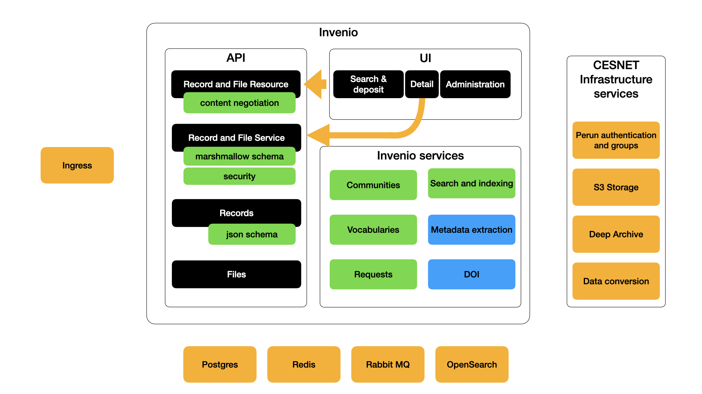

# Invenio repository architecture

Invenio server is based on the FLASK + SQLAlchemy frameworks. It consists of API and UI chains and a set of infrastructure services.

User request passes through front-end nginx or k8s ingress, is passed to uwsgi server and goes through Flask pipeline
to the repository API or UI chain.

## API Chain

### Resource layer

The chain begins with a set of classes contained in the "resources" python package. This part is responsible for:

* extract and validate the query parameters
* extract the payload
* perform content negotiation - what is the data format of the payload and what is the expected response data format

If one of the steps above fails, the processing is aborted and HTTP error code returned.

### Service layer

Service layer work with "abstract" request data which is HTTP independent. It provides the business logic layer
of the standard 3-tier application model.

In this level:

* permissions are checked
* semantics of the data is validated via Marshmallow framework (for example, during deposit)
* request is passed to the Record (persistence) or Search layers

### Record layer

Record layer is responsible for the physical storage of the repository record into an external database or file storage.
It is responsible for:

* minting persistent IDs
* structural validation of the metadata is performed via JSON schemas
* record is versioned and stored into the database

### Search layer

The search layer is responsible for indexing the metadata in an external opensearch/elasticsearch cluster.
After indexing, this layer provides:

* metadata search and aggregations
* metadata retrieval - metadata are taken from the search backend, not from the primary storage backend

## UI Chain

The UI chain in invenio comprises of two technologies:

* Server-side rendering with jinja2 templating is used for record landing ("detail") page.
  Using statically rendered pages leads to better SEO even for non-javascript crawlers (whatsapp, twitter, ...)
* Client-side rendering with React is used for deposit forms, search page and administration as these are usually
  not indexed in search engines. Using client-side technology here gives better user experience and faster responses.

### Server-side rendering

During server-side rendering, the service layer is used to get the data. This guarantees that security checks and internal
validation is performed the same way as if the information were submitted/retrieved by API requests.

### Client-side rendering

Client-side rendering uses the normal API endpoints with session and token-based authentication.

## Invenio services

### Vocabularies

### Communities

### Requests

### Search and Indexing

### Metadata extraction

### DOI minting

TODO

## Infrastructure services

### PERUN authentication and groups

### S3-compatible distributed storage

### Deep archival services (LTP)

### Data format conversion services
