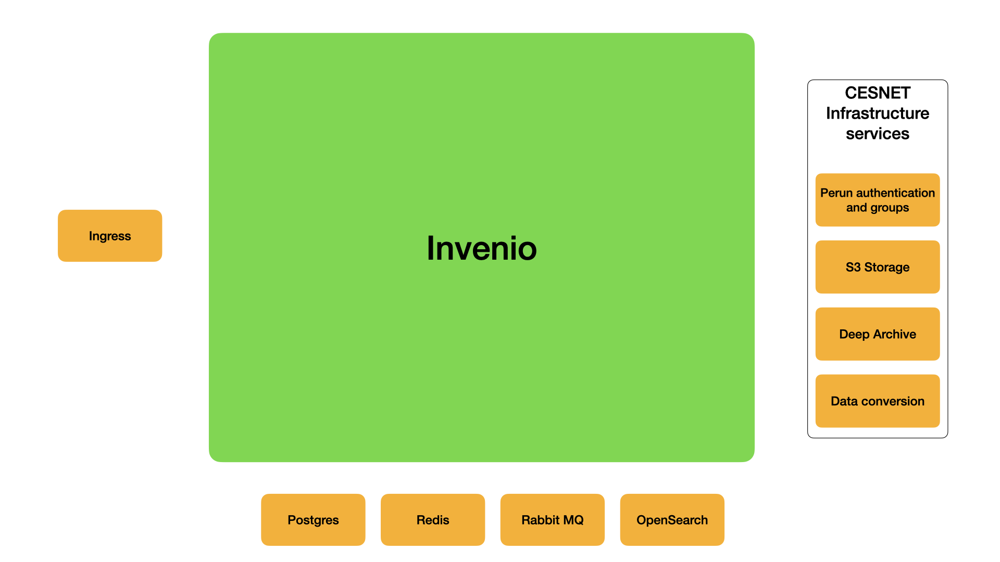

# Required ecosystem services

The following services are required for running the repository. In real deployment, these services
might be run containerized (inside docker or k8s infrastructure) or on bare metal.

Invenio provides sample **docker-compose files** to be used while developing the repository. 

To plan to run these services in k8s (either your own cluster or CESNET), please ask CESNET for
a sample configuration.

## Development

The development requires Linux or MacOS. **Invenio does not run on Windows.**

The following components are required in development:

* Redis 7 - cache, user sessions
* Postgresql 12+ - database backend
* RabbitMQ - for background tasks
* OpenSearch 2.0+ - for indexing metadata

Recommended components:

* PGAdmin
* Opensearch Dashboards
* Minio - S3 compatible simple storage

Additionally to these docker services, you will need the following packages installed on your system:

* Python (currently version 3.9 is supported)
* Pipenv
* Docker and Docker compose
* Node (currently version 14 is supported)
* NPM (currently version 6 is supported)
* Imagemagick
* Git

## Deployment

For deployment all the above services plus:

* Postgresql - cluster of postgres databases is recommended
* OpenSearch - cluster of opensearch engines is recommended
* NGINX / k8s ingress as a frontend web server
