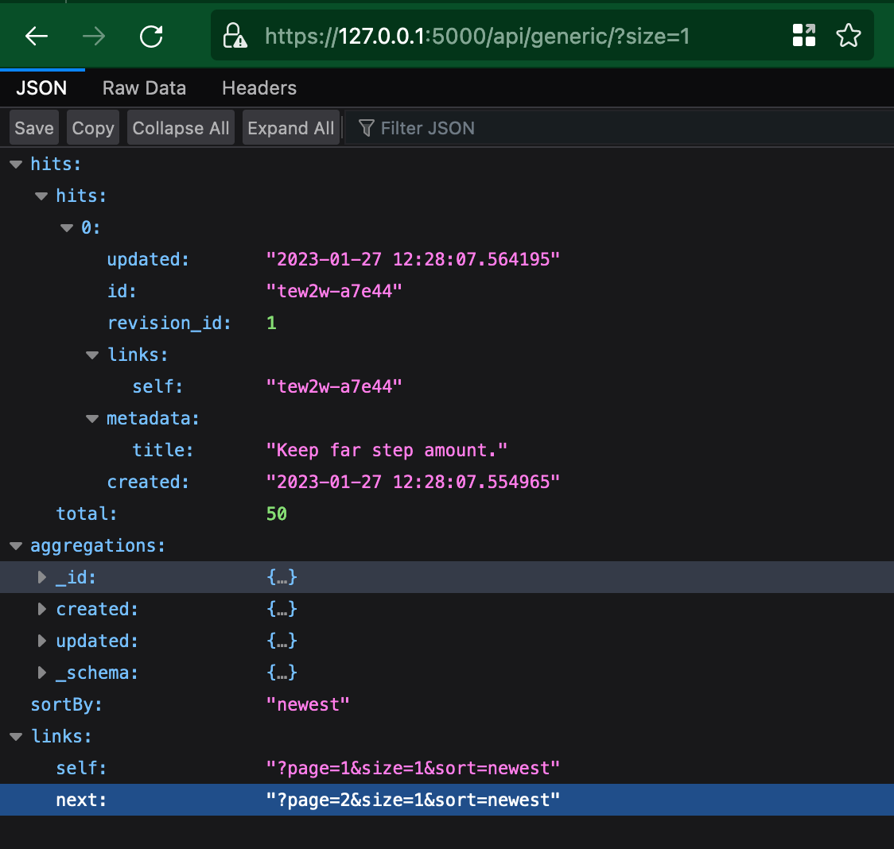

# Install the model

To install the model into a repository site, invoke `nrp-cli model install <model-name>`. 
It will ask you if you want to run tests on your model (<span style={{color: "red"}}>WIP, please do not select it now</span>), install the model
into the site and perform database migrations to create the necessary tables. Finally it will
create opensearch indices and aliases for the model.

Finally, run the server (`./nrp-cli run`) and head your browser to `https://localhost:5000/api/model-name/` - your API should be running there:



**Note**: sample data have been imported into the API - it can be done by:

```bash
cd sites/<site-module>
pipenv run invenio <modelname> load \
    ../../models/<modelname>/data/sample.yaml
```

We will add a nrp-cli shortcut for it.